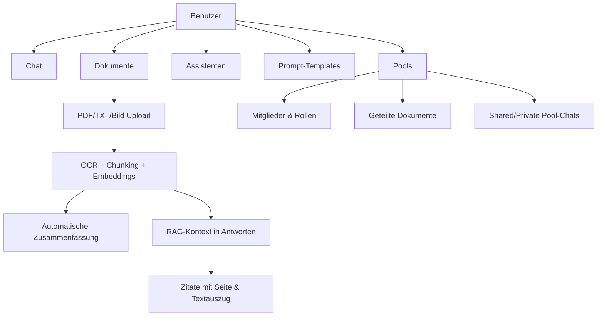
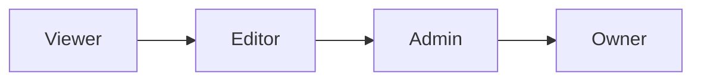
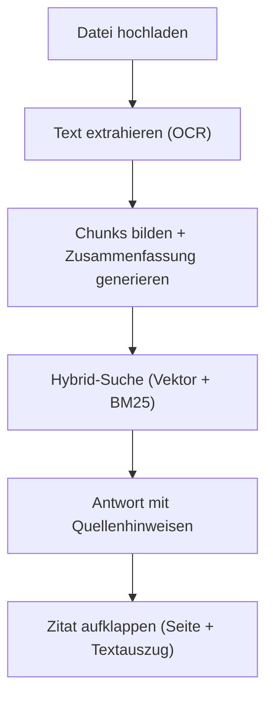
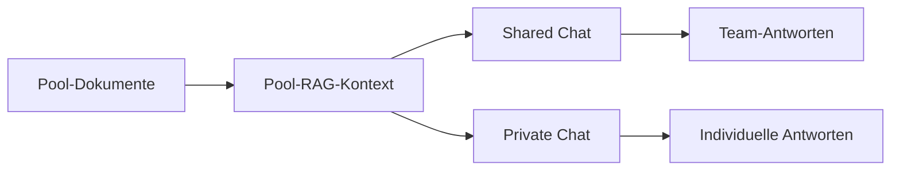

# Anwender-Dokumentation

Stand: 22.03.2026
Produkt: **XQT5 AI Plattform**

## 1. Ziel der Anwendung

Die XQT5 AI Plattform ist ein AI-Workspace für Teams und Einzelnutzer.
Sie kombiniert:

- Multi-LLM-Chat (mehrere KI-Provider)
- Wissensarbeit mit Dokumenten (RAG)
- wiederverwendbare Assistenten und Prompt-Templates
- geteilte Wissensräume ("Pools")

## 2. Funktionsübersicht

## 3. Benutzeroberfläche

### 3.1 Aufbau

Die Oberfläche besteht aus drei Bereichen:

| Bereich | Beschreibung |
|---------|-------------|
| **NavRail** (ganz links, schmal) | Dauerhafte Navigationsleiste mit Icons für Chats, Pools, Assistenten, Templates und Admin |
| **Sidebar** (ausklappbar) | Kontextbereich mit Chat-Liste oder Pool-Liste — erscheint als halbtransparentes Panel über dem Hauptbereich |
| **Hauptbereich** (rechts) | Chat, Pool-Inhalt oder Welcome-Screen |

### 3.2 Navigation

- **XQT5-Logo** (oben links in der NavRail): Klick kehrt jederzeit zum Welcome-Screen zurück
- **Chats-Icon**: öffnet die Sidebar mit der Chat-Liste — enthält **persönliche Konversationen und alle Pool-Chats** gemeinsam, chronologisch sortiert. Pool-Chats sind durch einen farbigen linken Rahmen (Pool-Farbe) und eine Sub-Zeile mit Pool-Icon + „Pool: <Name>" markiert. Klick auf einen Pool-Chat-Eintrag öffnet ihn direkt im Pool-Kontext.
- **Pools-Icon**: öffnet die Sidebar mit der Pool-Liste (für Pool-Verwaltung, Mitglieder, Dokumente)
- **Assistenten- / Templates-Icon**: öffnet den jeweiligen Manager
- **Sidebar schließen**: Klick auf den Hauptbereich schließt die Sidebar automatisch; sie schließt sich auch beim Öffnen einer Konversation oder eines Pools

### 3.3 Welcome-Screen

Der Welcome-Screen erscheint beim Start und nach dem Klick aufs Logo. Von hier aus kann direkt eine neue Chat-Frage eingegeben werden — ohne vorher eine Konversation anzulegen.

## 4. Rollen und Berechtigungen

### 4.1 Plattform-Rollen

- **User**: Chat, eigene Dokumente, eigene Assistenten/Templates, Pools nutzen
- **Admin**: alle User-Rechte plus Admin-Dashboard (Benutzer, Modelle, Provider, Audit)

### 4.2 Pool-Rollen

- **Viewer**: lesen, Fragen stellen
- **Editor**: zusätzlich Dokumente hochladen/löschen
- **Admin**: zusätzlich Mitglieder und Einladungen verwalten
- **Owner**: impliziter Pool-Besitzer, kann Pool löschen

## 5. Hauptbereiche im Alltag

### 5.1 Chat

- Neue Konversation über die Sidebar (Chats-Icon) oder direkt über den Welcome-Screen starten
- Modell auswählen (z. B. OpenAI, Anthropic, Google, Mistral, xAI, Azure OpenAI, Mammouth.ai)
- Temperatur einstellen
- Streaming-Antworten in Echtzeit
- Auto-Titel für neue Konversationen

### 5.2 Assistenten

- Eigene Assistenten mit:
  - Name, Icon, Beschreibung
  - System-Prompt
  - optionalem Modell-/Temperatur-Override
- Auswahl eines Assistenten startet direkt einen passenden Chat-Kontext

### 5.3 Prompt-Templates

- Wiederverwendbare Prompt-Bausteine
- Kategorien und Beschreibung
- Direkte Einfügung im Nachrichteneingabefeld

### 5.4 Dokumente und RAG

- Upload von **PDF**, **TXT**, **Markdown** (`MD`), **CSV**, **Office** (`DOCX`, `XLSX`, `XLS`) und **Bildern** (`PNG`, `JPG`, `JPEG`, `WEBP`)
- Mehrere Dateien gleichzeitig auswählbar (max. 2 parallele Uploads; Batches > 20 Dateien lösen einen Hinweis aus, weil das serverseitige Limit bei 20 Uploads pro Minute liegt)
- Automatische Extraktion:
  - PDF via OCR (Mistral)
  - Bilder via OCR
  - TXT / MD via UTF-8-Textimport
  - CSV via Markdown-Tabellen-Konvertierung (Delimiter wird automatisch erkannt)
  - DOCX via `python-docx` (Absätze + Tabellen, Überschriften werden zu Markdown-Headings)
  - XLSX via `openpyxl` (pro Sheet eine `## Sheet-Name`-Überschrift + Markdown-Tabelle)
  - XLS via `xlrd` (Legacy-Format, gleiche Sheet-pro-Tabelle-Logik wie XLSX)
- Inhalt wird gechunkt, mit Embeddings indexiert und bei passenden Fragen als Kontext zugespielt
- Hybrid-Suche: Vektorsuche und Volltextsuche (BM25) werden kombiniert für bessere Treffsicherheit
- **Fortschrittsanzeige beim Hochladen**: Ein Fortschrittsbalken zeigt den Upload-Status an (Datei übertragen → OCR-Verarbeitung)
- **Automatische Zusammenfassung**: Nach dem Upload wird automatisch eine kurze Zusammenfassung des Dokuments erstellt und in der Dokumentliste sowie Vorschau angezeigt

#### Quellenhinweise und Zitatmodus

Nach einer RAG-gestützten Antwort werden Quellen angezeigt:

- **Dateiname** der Quelle
- **Seitenzahl** (z. B. "S. 4"), sofern im Dokument vorhanden
- **Aufklappbarer Textauszug** (Zitatmodus): Klick auf die Quelle zeigt den genauen Textabschnitt, aus dem die Antwort stammt

### 5.5 Pools (Geteilte Wissenssammlungen)

- Pool erstellen (Name, Beschreibung, Icon, Farbe)
- Mitglieder per Username hinzufügen
- Invite-Links mit Rolle, Ablaufdatum, Nutzungslimit
- Dokumente poolweit teilen — per **Datei-Upload** oder **Text direkt einfügen** ("Text einfügen"-Button)
- Zwei Chat-Typen:
  - **Shared Chat**: für alle Mitglieder sichtbar
  - **Private Chat**: nur für Ersteller sichtbar, aber gegen Pool-Wissen
- Alle Pool-Chats erscheinen zusätzlich in der Hauptliste der Chats (Sidebar → Chats-Icon), gemischt mit persönlichen Konversationen und chronologisch sortiert. Sie sind dort durch farbigen linken Rahmen + Pool-Tag eindeutig markiert.

**Dokument-Vorschau im Pool:**
- In der Dokumentliste erscheint unter dem Dateinamen automatisch eine kurze Zusammenfassung.
- Der Button **"Vorschau"** öffnet ein Modal mit:
  - Zusammenfassung des Dokuments
  - Textvorschau (PDF/TXT) oder Bildansicht (Bilder)
  - Hinweis bei gekürzten Inhalten
- Vorschau ist für alle Pool-Mitglieder verfügbar (ab Rolle **Viewer**).

## 6. Typische Arbeitsabläufe

### 6.1 Wissensarbeit mit eigenen Dokumenten

1. Neue Konversation starten
2. Relevante Dokumente hochladen (Fortschrittsbalken abwarten)
3. Automatische Zusammenfassung in der Dokumentliste prüfen
4. Frage stellen
5. Antwort inkl. Quellen prüfen — Zitat aufklappen für genauen Textabschnitt und Seitenangabe
6. Optional Assistent/Template ergänzen

### 6.2 Team-Wissensraum mit Pools

1. Pool erstellen
2. Mitglieder einladen (Rolle festlegen)
3. Dokumente in den Pool laden
4. Automatische Zusammenfassungen nutzen, um Inhalte schnell zu überblicken
5. Über **Vorschau** Dokumentinhalt vorab prüfen
6. Shared Chat für gemeinsame Diskussion nutzen
7. Private Chat für persönliche Vertiefung nutzen

## 7. Hinweise für Anwender

- **Modellauswahl**: Welche Modelle verfügbar sind, hängt von der Admin-Konfiguration ab. Neben den Standard-Providern (OpenAI, Anthropic, Google, Mistral, xAI, Azure) kann auch **Mammouth.ai** als Aggregator mit Zugang zu GPT-5.x, Claude 4.x, Gemini 3.x und weiteren Modellen verfügbar sein.
- **Sidebar**: Klick auf den Hauptbereich schließt die Sidebar — das ist gewollt. Zur NavRail navigieren, um sie wieder zu öffnen.
- **Welcome-Screen**: Jederzeit über das XQT5-Logo erreichbar. Von dort kann sofort eine neue Frage eingegeben werden.
- **Sessions**: Bei deaktivierten Benutzern werden Sessions sofort ungültig — neu einloggen.
- **Seitenzahlen in Zitaten**: Nur bei Dokumenten verfügbar, die nach der letzten Plattform-Aktualisierung hochgeladen oder neu verarbeitet wurden.
- **Fehlende Zusammenfassung oder Modell**: Admin kontaktieren.
