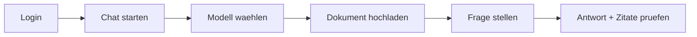
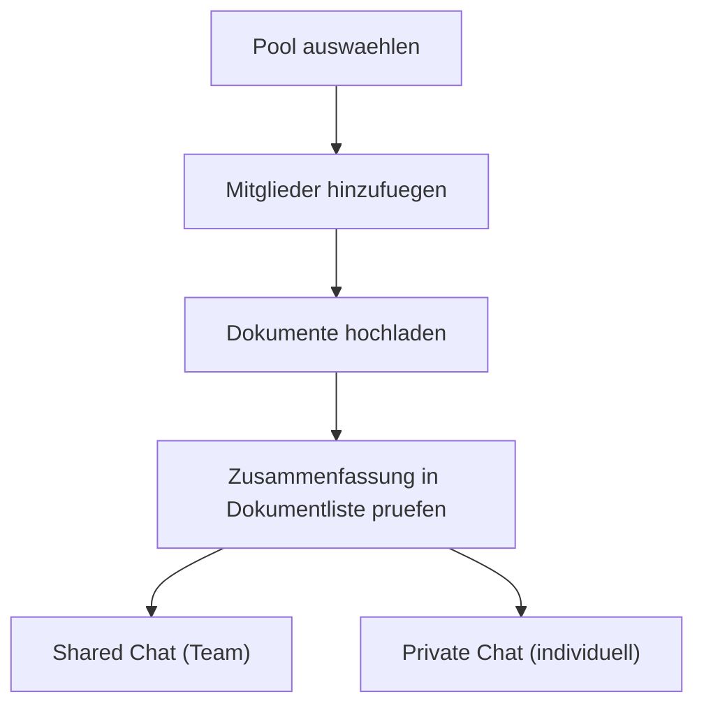

# Anwender Quickstart

Stand: 22.03.2026
Produkt: **XQT5 AI Plattform**

## 1. Ziel in 5 Minuten

Nach diesem Quickstart kannst du:

1. dich anmelden
2. einen Chat starten
3. ein Dokument hochladen
4. eine RAG-gestuetzte Antwort mit Quellen und Zitaten erhalten
5. optional in einem Pool mit anderen zusammenarbeiten

## 2. Schnellueberblick

## 3. Schritt-fuer-Schritt

### Schritt 1: Einloggen

1. Oeffne die Plattform im Browser.
2. Melde dich mit Benutzername und Passwort an.
3. Falls noetig: registriere zuerst einen neuen Account.
4. Nach dem Login erscheint der **Welcome-Screen** mit dem Eingabefeld. Hier kannst du direkt loslegen.

> **Tipp**: Klick auf das XQT5-Logo (oben links) bringt dich jederzeit zurueck zum Welcome-Screen.

### Schritt 2: Navigation verstehen

Die Oberflaeche hat drei Bereiche:
- **NavRail** (ganz links): dauerhafte Icon-Leiste fuer Chats, Pools, Assistenten, Templates
- **Sidebar** (ausklappbar): Konversations- oder Pool-Liste als halbtransparentes Panel
- **Hauptbereich**: Chat oder Pool-Inhalt

Die Sidebar oeffnet sich per Klick auf ein NavRail-Icon und schliesst sich automatisch, wenn du in den Hauptbereich klickst oder eine Konversation/einen Pool auswaehlen.

### Schritt 3: Neuen Chat starten

**Option A — direkt vom Welcome-Screen:**
1. Frage in das Eingabefeld eingeben und absenden.
2. Ein neuer Chat wird automatisch angelegt.

**Option B — ueber die Sidebar:**
1. Chats-Icon in der NavRail klicken (Sprechblasen-Symbol).
2. "New Conversation" in der Sidebar klicken.
3. Modell im Dropdown auswaehlen.
4. Optional: Temperatur einstellen (niedriger = praeziser, hoeher = kreativer).

### Schritt 4: Dokument hinzufuegen (RAG)

1. Lade eine Datei hoch (`.pdf`, `.txt`, `.png`, `.jpg`, `.jpeg`, `.webp`).
2. Ein Fortschrittsbalken zeigt den Upload-Status an (Datei-Transfer → OCR-Verarbeitung).
3. Nach der Verarbeitung erscheint unter dem Dateinamen automatisch eine kurze Zusammenfassung.
4. Warte bis der Status "ready" angezeigt wird.
5. Stelle dann eine konkrete Frage zum Inhalt.

Beispiel:
- "Fasse Kapitel 3 in 5 Stichpunkten zusammen."
- "Welche Risiken werden im Dokument genannt?"

### Schritt 5: Antwort und Quellen pruefen

1. Pruefe die Antwort.
2. Unter der Antwort werden Quellen angezeigt — mit Dateiname und Seitenzahl (z. B. "Bericht.pdf (S. 4)").
3. Klicke auf eine Quelle, um den genauen Textauszug aufzuklappen (Zitatmodus).
4. Verfeinere die Frage bei Bedarf (z. B. engeren Fokus setzen).

## 4. Optional: Mit Assistenten und Templates schneller arbeiten

**Assistenten** sind vorkonfigurierte Rollen mit eigenem System-Prompt:
1. Assistenten-Icon in der NavRail klicken
2. Assistent auswaehlen — Chat startet mit passendem Kontext
3. Fragen wie gewohnt stellen

**Templates** sind wiederverwendbare Prompt-Bausteine:
1. Template-Icon in der NavRail klicken
2. Template auswaehlen — Text wird ins Eingabefeld eingefuegt
3. Felder anpassen und senden

## 5. Optional: Teamarbeit mit Pools

Pools sind geteilte Wissensraeume mit Rollen.

1. Pools-Icon in der NavRail klicken
2. Pool auswaehlen oder neuen Pool erstellen
3. Die Sidebar schliesst sich automatisch — der Pool-Inhalt erscheint im Hauptbereich

Pool-Rollen:
- **Viewer**: lesen + fragen
- **Editor**: zusaetzlich Dokumente verwalten (Datei-Upload oder Text einfuegen)
- **Admin**: zusaetzlich Mitglieder und Einladungen verwalten
- **Owner**: Pool-Besitzer

Tipps:
- Statt eine Datei hochzuladen kannst du im Pool-Dokumenttab auch direkt Text einfuegen ("Text einfuegen"-Button). Der Text wird genauso verarbeitet wie eine hochgeladene Datei.
- In der Dokumentliste siehst du unter jedem Dateinamen die automatische Zusammenfassung.
- Klicke auf "Vorschau", um die vollstaendige Zusammenfassung und einen Textauszug des Dokuments zu sehen.

## 6. Wenn etwas nicht funktioniert

- **Sidebar verschwunden**: Klick auf das entsprechende Icon in der NavRail (links) oeffnet sie erneut.
- **Kein Modell sichtbar**: Admin muss Modell/Provider aktivieren.
- **Dokumentverarbeitung schlaegt fehl**: Dateityp pruefen (`PDF/TXT/Bild`), Datei ggf. kleiner machen.
- **Keine Quellen bei Antwort**: pruefen, ob Dokumentstatus "ready" ist.
- **Keine/zu kurze Vorschau**: Vorschau zeigt Textauszug; bei sehr langen Dokumenten ist sie gekuerzt.
- **Login/Session bricht ab**: ggf. neu einloggen (Token wurde evtl. invalidiert).
- **Keine Zusammenfassung oder Seitenzahl**: bitte Admin kontaktieren.

## 7. Empfohlener Standard-Workflow

1. Chat erstellen
2. Relevante Dokumente hochladen (Zusammenfassung pruefen)
3. Frage mit klarem Ziel stellen
4. Quellen und Zitate pruefen
5. Ergebnis iterativ verfeinern

Damit erreichst du in der Regel die beste Balance aus Geschwindigkeit und Qualitaet.
